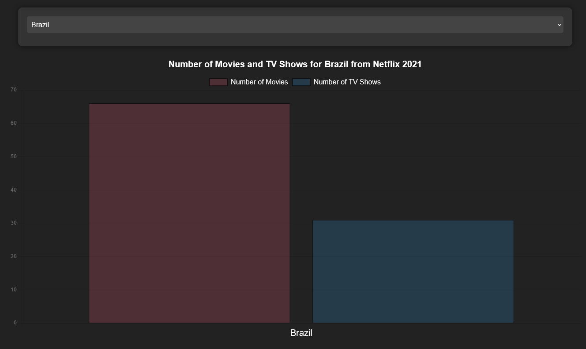

# Project Title

FlixFlow: Netflix Data Visualization

## Project Description

The Flixflow project is a data visualization project that aims to provide insights into the Netflix dataset. The dataset contains information about the movies and TV shows available on Netflix as of 2021. The dataset includes information about the title, director, cast, country, date added, release year, rating, duration, listed in, description, and type of the content. The dataset is available on Kaggle and was chosen because it is a popular dataset and i found it interesting to work with. The dataset used in the Flixflow project contains approximately 8800 documents. These documents comprise information about the movies and TV shows available on Netflix as of 2021, covering various aspects such as title, director, cast, country, date added, release year, rating, duration, and more.

## Core Technologies

**Backend**: Node.js, Express.js, JavaScript - Node.js and Express.js were chosen for their flexibility and scalability in building RESTful APIs and handling HTTP requests. JavaScript is used for server-side scripting.

**Logging**: Winston - Winston is a versatile logging library for Node.js, providing customizable logging options and support for various transports.


**Dependency Injection**: InversifyJS - InversifyJS is a powerful and lightweight inversion of control (IoC) container for JavaScript and Node.js applications. It helps manage dependencies and promotes modular design.

**Data Analysis & Processing**: MongoDB, Mongoose - MongoDB is a NoSQL database chosen for its flexibility and scalability, making it suitable for handling large datasets. In this project, I am utilizing MongoDB's aggregation framework through Mongoose, specifically employing the aggregate() method. This method enables the execution of complex data processing pipelines directly within the MongoDB database. By chaining together various stages such as $match, $group, I can perform advanced data manipulation tasks, including filtering, grouping, and reshaping the dataset. Due to inaccuracies in the original data, I needed to reshape it to obtain accurate information. This approach ensures efficient data retrieval and processing, optimizing performance for generating insights and visualizations from the Netflix dataset.

**Data Visualization**: Chart.js - Chart.js is a popular JavaScript library for creating interactive and visually appealing charts and graphs, providing flexibility and ease of integration into web applications. I chose to load it directly in the HTML file instead of importing it in the JavaScript file due to encountered issues with the import. By including Chart.js directly in the HTML file, I ensure the library is readily available for chart creation without complications.

**Front-end application**: HTML, CSS, JavaScript, express-ejs-layouts - HTML, CSS, and JavaScript are standard technologies for building frontend web applications. express-ejs-layouts is used with Express.js for rendering dynamic views and layouts on the server-side.

## How to Use

1. Select a Country: Use the dropdown menu to choose a country.
2. View Movie and TV Show Counts: After selecting a country, two diagrams will be displayed:
  - The first diagram shows the number of movies and TV shows available in the selected country on Netflix.
  
  - The second diagram displays the distribution of ratings for movies and TV shows in the selected country.
  

## Link to the Deployed Application

(https://cscloud8-66.lnu.se/WT2/api/v1/wt2)

## Additional features

I have implemented the following features to address this issue https://gitlab.lnu.se/1dv027/student/no222hh/assignment-wt2/-/issues/12: 
I am using MongoDB, as mentioned earlier, and employing the aggregation framework to process the data. 
Aggregation operations process multiple documents and return computed results. You can use aggregation operations to:

 - Group values from multiple documents together.
 - Perform operations on the grouped data to return a single result.
 - Analyze data changes over time.

Aggeration operations are performed using the aggregate() method. The method accepts an array of data processing pipelines, where each pipeline consists of one or more stages. Each stage performs a specific data processing task, such as filtering, grouping, or reshaping the data. By chaining together multiple stages, you can create complex data processing pipelines to generate insights and visualizations from the Netflix dataset.

It was hard to get the right data from the dataset, so I had to reshape the data to get the right information. Based on the country column, i used a regular expression to match the queried country and then split the countries into separate documents. Before grouping the data by type and rating, I had to unwind the array of countries to get accurate results. And then i grouped the ratings data by type and rating to get the count of each rating for movies and TV shows in the selected country.
Example of an aggregation pipeline:

```javascript
  async getAllDocumentsForCountryAndRating (country) {
    try {
      const pipeline = []
      // Split the countries into separate documents
      pipeline.push(
        { $match: { country: { $regex: new RegExp(`\\b${country}\\b`, 'i') } } }, // Match documents with the queried country
        { $addFields: { countries: { $split: ['$country', ', '] } } }, // Split the countries field
        { $unwind: '$countries' }, // Unwind the array of countries
        { $match: { countries: country } } // Match documents with the queried country
      )
      // Group the ratings data by type and rating
      pipeline.push(
        { $group: { _id: { type: '$type', rating: '$rating' }, count: { $sum: 1 } } },
        { $sort: { '_id.type': 1, '_id.rating': 1 } }
      )
      const documents = await this.model.collection.aggregate(pipeline).toArray()
      return documents
    } catch (error) {
      throw new RepositoryError({ message: 'Failed to get documents.', cause: error })
    }
  }
```


